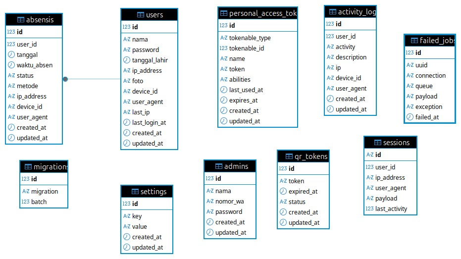

# 📌 ABSENIN 
Sistem Absensi QR Code Berbasis Web
adalah aplikasi berbasis web yang digunakan untuk mencatat kehadiran siswa secara **real-time**, **aman**, dan **terkontrol** menggunakan teknologi QR Code.  
Sistem ini dirancang untuk mencegah kecurangan absensi, mendukung monitoring langsung oleh admin, serta menyediakan riwayat kehadiran yang akurat.

---

## 🎯 Tujuan Sistem

- Mengganti absensi manual menjadi **digital dan otomatis**
- Mencegah titip absen menggunakan **QR Token & Device Lock**
- Memberikan **monitoring real-time** untuk admin
- Menyediakan **dashboard siswa dan admin** yang informatif
- Mendukung rekap absensi harian, mingguan, dan bulanan

---

## 🧩 Fitur Utama

### 👨‍🎓 Fitur Siswa
- Login siswa
- Scan QR Code untuk absensi
- Status absensi hari ini (Hadir / Terlambat / Alpha)
- Riwayat absensi pribadi
- Informasi waktu dan metode absensi
- Dashboard responsif (mobile friendly)

### 👨‍💼 Fitur Admin
- Dashboard admin (overview kehadiran hari ini)
- Generate QR Code (token dinamis & expired)
- Live Monitoring absensi (real-time)
- Absensi manual (izin, sakit, alpha)
- Kalender absensi
- Buku absensi & rekap data
- Manajemen siswa
- Pengaturan jam absensi (jam awal, tepat waktu, terlambat)
- Export data absensi (siap dikembangkan)

---

## 🔐 Sistem Keamanan

Sistem ini menerapkan beberapa lapisan keamanan:

- **QR Token Dinamis**
  - Token hanya aktif dalam waktu tertentu
  - Token otomatis kedaluwarsa

- **Session Validation**
  - Siswa harus login untuk melakukan scan

- **Device Lock (Opsional)**
  - Satu akun hanya dapat digunakan pada satu perangkat
  - Admin dapat melakukan reset device bila diperlukan

- **IP Address Tracking**
  - IP disimpan untuk keperluan audit & monitoring

---

## ⏱️ Penentuan Status Absensi

Status absensi ditentukan **satu kali saat proses scan QR** dan disimpan ke database:

| Waktu Absen | Status |
|------------|--------|
| ≤ Jam Tepat | Hadir |
| > Jam Tepat & ≤ Jam Terlambat | Terlambat |
| > Jam Terlambat | Alpha |

Semua tampilan (Admin & Siswa) **mengambil data langsung dari database**  
(tidak ada perhitungan ulang di sisi tampilan).

---

## 🏗️ Teknologi yang Digunakan

- **Framework**: Laravel
- **Bahasa**: PHP
- **Database**: MySQL
- **Frontend**: Blade Template + Tailwind CSS
- **QR Code**: SimpleSoftwareIO QrCode
- **Chart**: Chart.js
- **Realtime Update**: AJAX / Fetch API
- **Time Handling**: Carbon (Asia/Jakarta)

---

## 📂 Struktur Direktori Penting

```

app/
├── Http/
│   ├── Controllers/
│   │   ├── AuthController.php
│   │   ├── ScanQrController.php
│   │   ├── AbsensiController.php
│   │   ├── AdminController.php
│   │   └── UserController.php
│
resources/
├── views/
│   ├── admin/
│   ├── user/
│   ├── auth/
│   └── layouts/
│
database/
├── migrations/
│
routes/
├── web.php


````

---

## ⚙️ Pengaturan Sistem

Admin dapat mengatur:
- Jam awal absensi
- Jam batas tepat waktu
- Jam batas terlambat
- Mode absensi

Semua pengaturan disimpan di database dan **langsung memengaruhi sistem** tanpa perlu restart.

---

## 🚀 Cara Menjalankan Project

1. Clone repository
```bash
git clone <repo-url>
````

2. Install dependency

```bash
composer install
npm install
```

3. Setup environment

```bash
cp .env.example .env
php artisan key:generate
```

4. Migrasi database

```bash
php artisan migrate
```

5. Jalankan server

```bash
php artisan serve
```

---

## 📌 Catatan Pengembangan

* Sistem sudah mendukung skala sekolah
* Mudah dikembangkan ke:

  * Notifikasi WhatsApp
  * Face recognition
  * Export laporan PDF / Excel
  * Multi kelas & jurusan

---

## 👨‍💻 Author

Dikembangkan sebagai proyek sistem informasi absensi modern berbasis web dengan fokus pada **keamanan, real-time monitoring, dan akurasi data**.

📊 Penjelasan Entitas pada ERD Sistem ABSENIN
ERD SISTEM HADIRIN

ERD ini menggambarkan struktur database utama dari Sistem Absensi QR Code (ABSENIN) yang digunakan untuk mengelola data siswa, absensi, admin, keamanan, serta pengaturan sistem.

1️⃣ users

Fungsi: Menyimpan data akun siswa yang menggunakan sistem absensi.

Atribut penting:

id → Primary Key

nama → Nama siswa

password → Password login siswa

tanggal_lahir → Data identitas siswa

ip_address, last_ip → Menyimpan IP terakhir (keamanan)

device_id → Identitas perangkat siswa (device lock)

user_agent → Informasi browser/perangkat

last_login_at → Waktu login terakhir

foto → Foto profil siswa


Peran di sistem:

Menjadi aktor utama dalam proses absensi

Terhubung langsung dengan tabel absensis

Digunakan untuk keamanan 1 akun = 1 perangkat


2️⃣ absensis

Fungsi: Menyimpan data kehadiran siswa setiap hari.

Atribut penting:

id → Primary Key

user_id → Foreign Key ke tabel users

tanggal → Tanggal absensi

waktu_absen → Jam absen

status → hadir / terlambat / izin / sakit / alpha

metode → qr / manual

ip_address, device_id, user_agent → Validasi keamanan


Relasi:

Many to One ke users (1 siswa bisa punya banyak absensi)


Peran di sistem:

Inti dari seluruh sistem absensi

Digunakan di:

Dashboard admin

Dashboard siswa

Rekap

Kalender

Ranking kehadiran


3️⃣ admins

Fungsi: Menyimpan data akun admin sistem.

Atribut penting:

id → Primary Key

nama → Nama admin

nomor_wa → Kontak admin (opsional / bisa dihapus)

password → Password admin


Peran di sistem:

Mengelola:

QR Code

Pengaturan jam

Absensi manual

Data siswa


Tidak ikut absensi (aktor pengelola)


4️⃣ qr_tokens

Fungsi: Menyimpan QR Code sementara untuk absensi.

Atribut penting:

id

token → Kode QR

expired_at → Masa berlaku QR

status → aktif / nonaktif


Peran di sistem:

Mencegah reuse QR

Menjamin absensi hanya di waktu tertentu

Menjadi penghubung antara admin & siswa saat absensi


5️⃣ settings

Fungsi: Menyimpan konfigurasi dinamis sistem.

Atribut penting:

key → Nama pengaturan

value → Nilai pengaturan


Contoh isi:

jam_awal

jam_tepat

jam_terlambat

mode_absen


Peran di sistem:

Menentukan status hadir / terlambat

Bisa diubah admin tanpa ubah kode

Digunakan di ScanQrController & AbsensiController


6️⃣ sessions

Fungsi: Menyimpan session login pengguna (Laravel default).

Atribut penting:

user_id

ip_address

user_agent

last_activity


Peran di sistem:

Menjaga status login siswa & admin

Digunakan untuk redirect otomatis:

login → dashboard

logout → hapus session


7️⃣ activity_logs

Fungsi: Mencatat aktivitas pengguna (audit trail).

Atribut penting:

user_id

activity → jenis aktivitas

description

ip

device_id

user_agent


Peran di sistem:

Monitoring keamanan

Bukti aktivitas user

Cocok untuk pengembangan fitur log aktivitas admin/siswa


8️⃣ personal_access_tokens

Fungsi: Digunakan untuk API authentication (Laravel Sanctum).

Atribut penting:

token

abilities

expires_at


Peran di sistem:

Saat ini belum dominan

Siap untuk pengembangan:

Mobile App

API eksternal

Integrasi sistem lain


9️⃣ failed_jobs

Fungsi: Menyimpan job background yang gagal.

Peran di sistem:

Debugging

Monitoring queue

Default Laravel (bukan fitur utama absensi)


🔟 migrations

Fungsi: Menyimpan riwayat struktur database.

Peran di sistem:

Kontrol versi database

Menjamin konsistensi struktur tabel


🔗 HUBUNGAN ANTAR ENTITAS (RINGKAS)

users ⟶ absensis (1:N)

admins ⟶ qr_tokens (logika sistem)

settings ⟶ seluruh proses absensi

sessions ⟶ users & admins

activity_logs ⟶ users

qr_tokens ⟶ absensis


Apakah sudah valid seperti tabel database di gambar??
